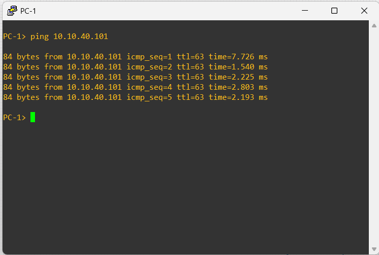
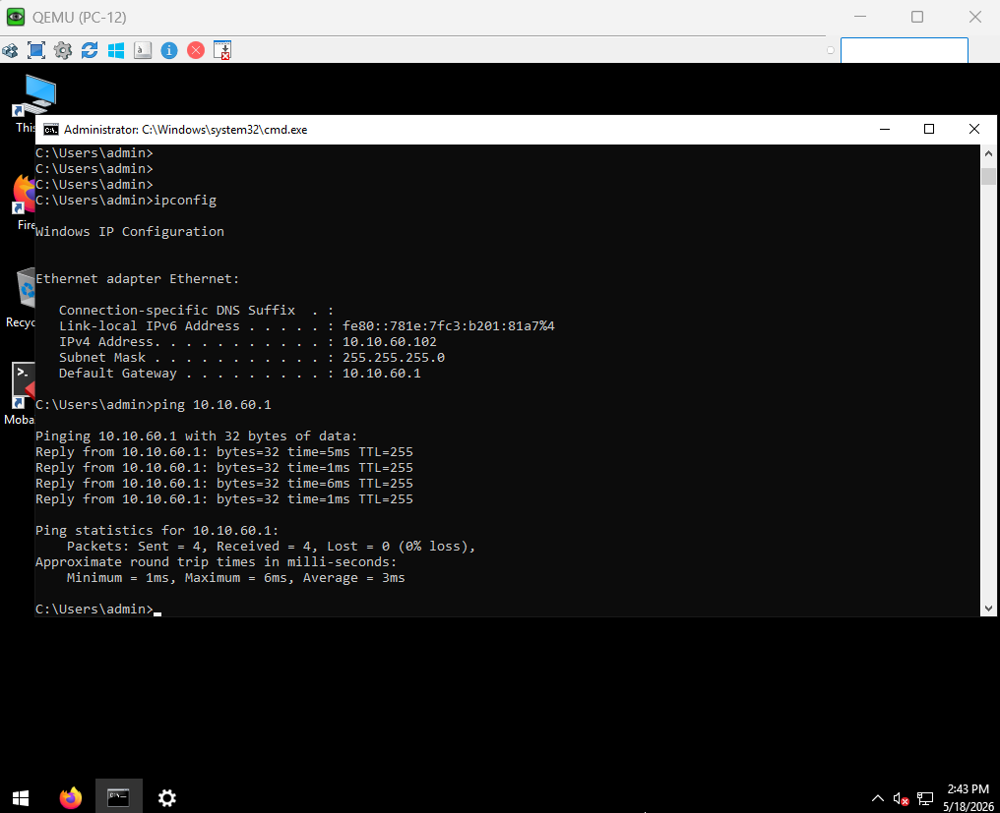
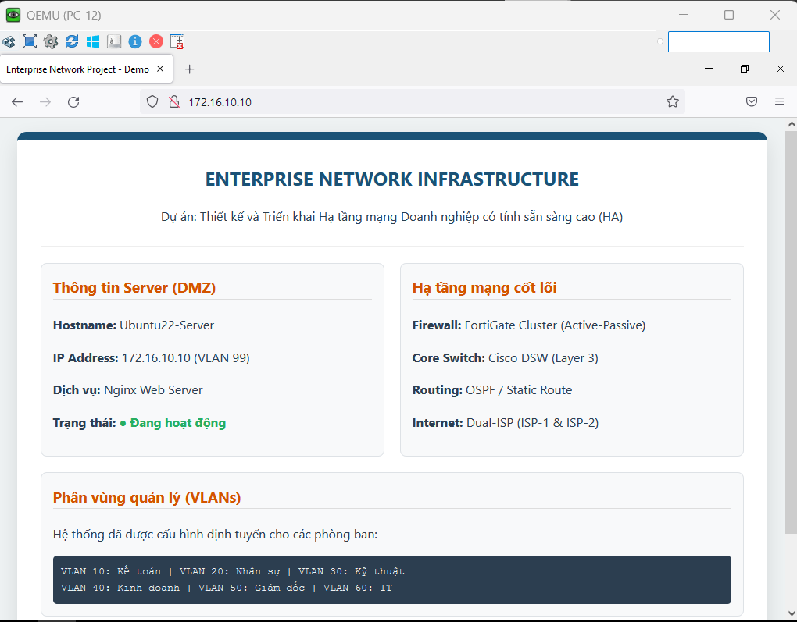
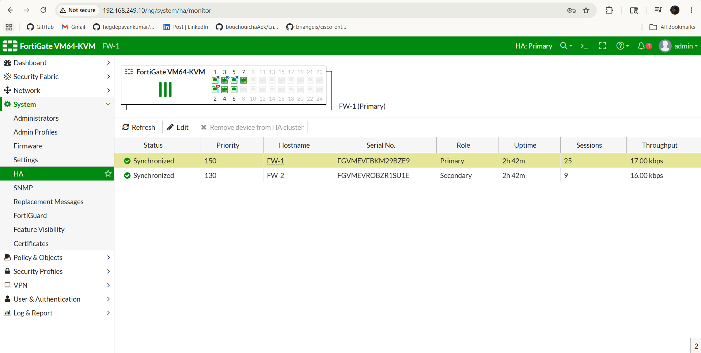
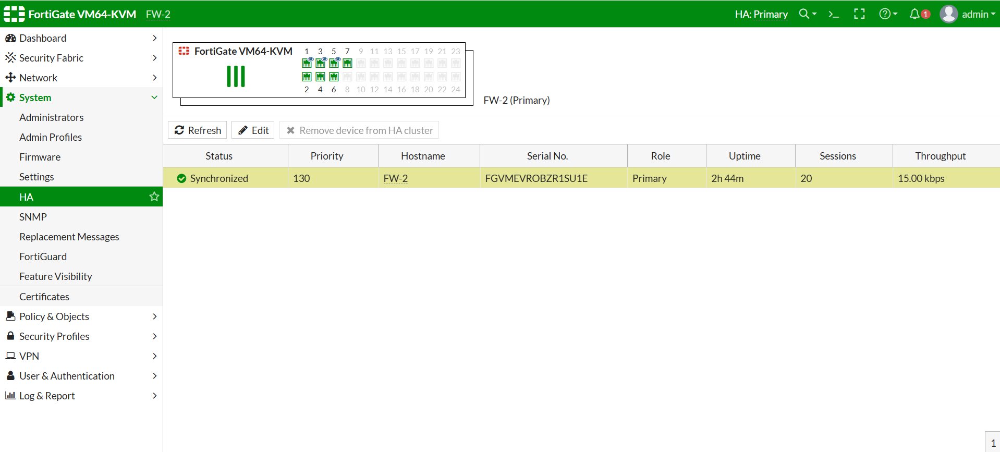
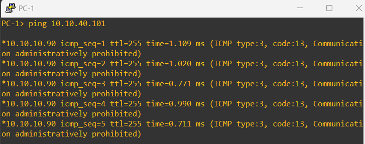
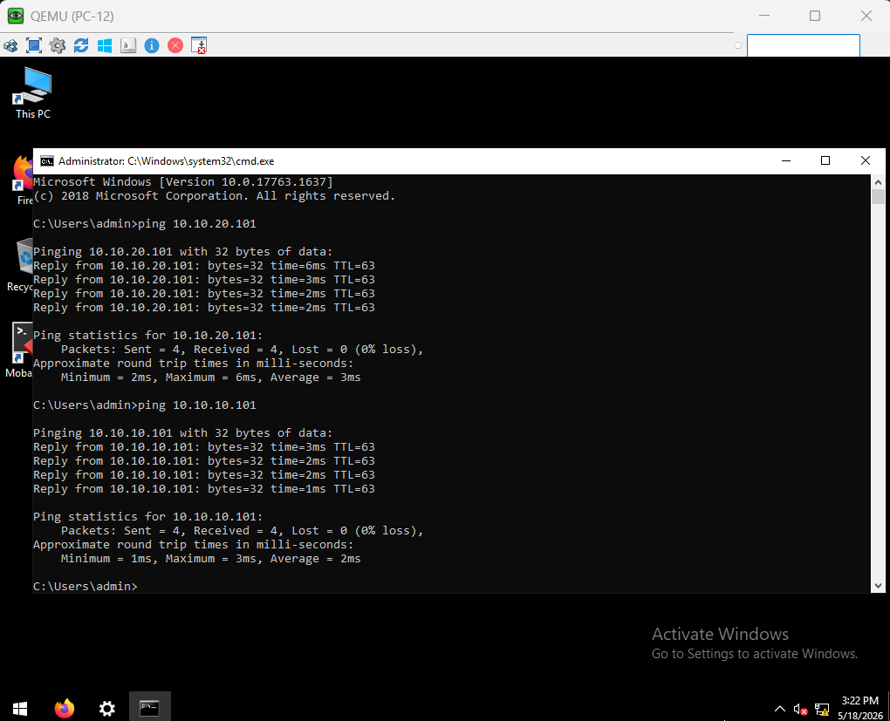
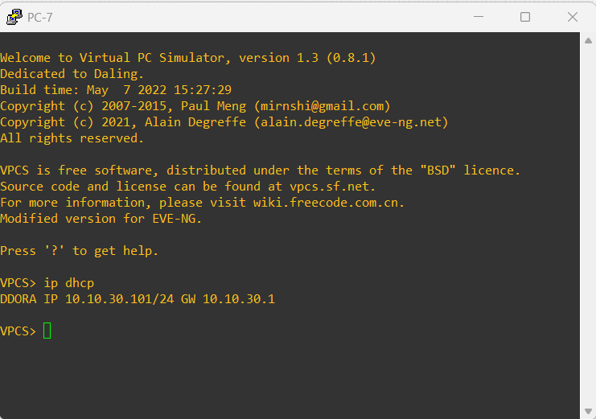

# Enterprise Network Infrastructure with Dual Firewall & DMZ Security

## Giới thiệu dự án

Dự án này mô phỏng và triển khai kiến trúc mạng doanh nghiệp hiện đại theo mô hình phân tầng, đảm bảo:

- **Tính sẵn sàng cao (High Availability)** với 2 đường Internet từ 2 ISP khác nhau
- **Bảo mật nhiều lớp** thông qua hệ thống Firewall kép
- **Phân vùng mạng nội bộ** bằng VLAN cho từng phòng ban
- **DMZ (Demilitarized Zone)** cho các dịch vụ công khai như:
  - Web Server
- **Quản trị tập trung (Management Network)**
- **Khả năng mở rộng linh hoạt** cho doanh nghiệp

---

## Sơ đồ hệ thống

---

## Kiến trúc tổng thể

### 1. Kết nối Internet

- **ISP-1** → Router R1 → Firewall FW-1
- **ISP-2** → Router R2 → Firewall FW-2

**Mục tiêu:**
- Dự phòng kết nối Internet
- Tăng tính sẵn sàng hệ thống
- Hỗ trợ failover khi xảy ra sự cố WAN

### 2. Firewall Layer

Bao gồm:

- **FW-1**: Active
- **FW-2**: Backup

**Chức năng:**
- NAT/PAT
- ACL Security Policies
- Load balancing/failover
- Kiểm soát truy cập giữa:
  - Internet ↔ DMZ
  - Internet ↔ Internal LAN
  - Internal VLAN ↔ VLAN

### 3. DMZ Zone
**Thành phần:**
- Web Server
- DMZ Switch

**Vai trò:**
- Cung cấp dịch vụ web công cộng
- Tách biệt với mạng LAN nội bộ
- Giảm nguy cơ tấn công trực tiếp vào hệ thống nội bộ

**Chính sách:**
- Internet → Web Server: Cho phép HTTP/HTTPS
- DMZ → LAN: Hạn chế tối đa
- LAN → DMZ: Kiểm soát theo ACL

### 4. Core Distribution Layer

- **DSW-1**
- **DSW-2**

Vai trò:

- Layer 3 Switching
- Inter-VLAN Routing
- Redundancy
- Trunking xuống Access Switches
- HSRP 
- DHCP 

### 5. Access Layer

Bao gồm:

- ASW-1 đến ASW-6

**Vai trò:**
- Kết nối người dùng đầu cuối
- Access VLAN cho từng phòng ban
- Uplink trunk tới Distribution Switch

---

## Phân chia VLAN

| VLAN | Phòng ban | Network |
|------|-----------|---------|
| VLAN 10 | Phòng Kế Toán | 10.10.10.0/24 |
| VLAN 20 | Phòng Nhân Sự | 10.10.20.0/24 |
| VLAN 30 | Phòng Kỹ Thuật | 10.10.30.0/24 |
| VLAN 40 | Phòng Kinh Doanh | 10.10.40.0/24 |
| VLAN 50 | Ban Giám Đốc | 10.10.50.0/24 |
| VLAN 60 | Phòng IT | 10.10.60.0/24 |
| VLAN 99 | DMZ | 172.16.10.0/24 |

---

## Kế hoạch địa chỉ IP

### WAN Links

| Kết nối | Subnet |
|--------|--------|
| ISP-1 ↔ R1 | 203.10.10.0/30 |
| ISP-2 ↔ R2 | 198.51.100.0/30 |
| R1 ↔ FW-1 | 10.255.0.0/30 |
| R2 ↔ FW-2 | 10.255.0.12/30 |
| FW Management | 10.255.255.0/30 |
| Core Network | 10.254.0.0/24 |

---

## Kiểm thử hệ thống

### Các bài test đã thực hiện:

- [x] **Ping giữa các VLAN**

**ping VLAN 10 ➜ VLAN 40**

**PC-12 ping default gateway**

---

- [x] **Truy cập Web Server DMZ**

---

- [x] **Failover Firewall**

**Trạng thái HA**

**Sau khi Primary Down**

---

- [x] ACL Security

**Ngăn chặn lưu lượng ICMP (ping) từ VLAN 10 đến VLAN 40**

**Lưu lượng từ VLAN 60 được phép kết nối tới các phân vùng**

---

- [x] DHCP cấp phát IP cho máy nội bộ

---

