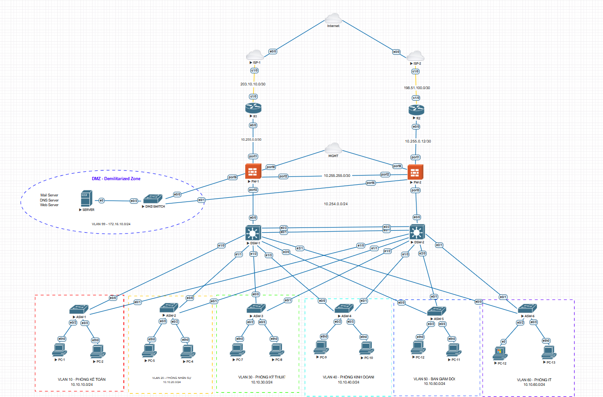

# Hệ thống mạng doanh nghiệp đa tầng với DMZ, Firewall HA và phân chia VLAN

## Giới thiệu dự án

Dự án này mô phỏng và triển khai kiến trúc mạng doanh nghiệp hiện đại theo mô hình phân tầng, đảm bảo:

- **Tính sẵn sàng cao (High Availability)** với 2 đường Internet từ 2 ISP khác nhau
- **Bảo mật nhiều lớp** thông qua hệ thống Firewall kép
- **Phân vùng mạng nội bộ** bằng VLAN cho từng phòng ban
- **DMZ (Demilitarized Zone)** cho các dịch vụ công khai như:
  - Web Server
  - DNS Server
  - Mail Server
- **Quản trị tập trung (Management Network)**
- **Khả năng mở rộng linh hoạt** cho doanh nghiệp

---

## Sơ đồ hệ thống



---

## Kiến trúc tổng thể

### 1. Kết nối Internet

- **ISP-1** → Router R1 → Firewall FW-1
- **ISP-2** → Router R2 → Firewall FW-2
- Hai đường truyền giúp:
  - Dự phòng khi một ISP gặp sự cố
  - Cân bằng tải
  - Tăng độ ổn định

### 2. Firewall Layer

Bao gồm:

- **FW-1**
- **FW-2**

Chức năng:

- NAT/PAT
- ACL Security Policies
- VPN
- IDS/IPS
- Load balancing/failover
- Kiểm soát truy cập giữa:
  - Internet ↔ DMZ
  - Internet ↔ Internal LAN
  - Internal VLAN ↔ VLAN

### 3. DMZ Zone

**VLAN 99: 172.16.10.0/24**

Chứa:

- Web Server
- DNS Server
- Mail Server

Ưu điểm:

- Cách ly khỏi mạng nội bộ
- Tăng bảo mật
- Cho phép truy cập công khai an toàn

### 4. Core Distribution Layer

- **DSW-1**
- **DSW-2**

Vai trò:

- Layer 3 Switching
- Inter-VLAN Routing
- Redundancy
- Trunking xuống Access Switches
- STP / HSRP / VRRP

### 5. Access Layer

Bao gồm:

- ASW-1 đến ASW-6

Mỗi switch phục vụ một phòng ban riêng.

---

## Phân chia VLAN

| VLAN | Phòng ban | Network |
|------|-----------|---------|
| VLAN 10 | Phòng Kế Toán | 10.10.10.0/24 |
| VLAN 20 | Phòng Nhân Sự | 10.10.20.0/24 |
| VLAN 30 | Phòng Kỹ Thuật | 10.10.30.0/24 |
| VLAN 40 | Phòng Kinh Doanh | 10.10.40.0/24 |
| VLAN 50 | Ban Giám Đốc | 10.10.50.0/24 |
| VLAN 60 | Phòng IT | 10.10.60.0/24 |
| VLAN 99 | DMZ | 172.16.10.0/24 |

---

## Kế hoạch địa chỉ IP

### WAN Links

| Kết nối | Subnet |
|--------|--------|
| ISP-1 ↔ R1 | 203.10.10.0/30 |
| ISP-2 ↔ R2 | 198.51.100.0/30 |
| R1 ↔ FW-1 | 10.255.0.0/30 |
| R2 ↔ FW-2 | 10.255.0.12/30 |
| FW Management | 10.255.255.0/30 |
| Core Network | 10.254.0.0/24 |

---

## Tính năng nổi bật

### Bảo mật

- Firewall Rules
- NAT/PAT
- DMZ Isolation
- VLAN Segmentation
- Access Control Lists
- Port Security
- DHCP Snooping
- Dynamic ARP Inspection

### Dự phòng

- Dual ISP
- Dual Router
- Dual Firewall
- Dual Distribution Switch
- Link Aggregation
- Spanning Tree Protocol
- HSRP/VRRP Gateway Redundancy

### Quản trị

- VLAN riêng cho quản trị
- SSH/SNMP/Syslog
- Centralized Monitoring
- Backup Configuration

---

## Thiết bị sử dụng

### Router

- Cisco IOL

### Firewall

- FortiGate 

### Switch Distribution

- Cisco Layer 3 Switch

### Switch Access

- Cisco Layer 2 Switch

### Server

- Linux/Windows Server
- Web: Apache/Nginx
- DNS: Bind9
- Mail: Postfix

---

## Mục tiêu triển khai

- Xây dựng hệ thống mạng doanh nghiệp thực tế
- Tăng cường bảo mật
- Đảm bảo hoạt động liên tục
- Phân tách rõ ràng các phòng ban
- Hỗ trợ mở rộng lâu dài
- Phục vụ đào tạo, nghiên cứu hoặc triển khai thực tế

---

## Kiểm thử hệ thống

### Các bài test đã thực hiện:

- Ping giữa các VLAN theo policy
- Kiểm tra failover ISP
- NAT Internet Access
- Public Web từ DMZ
- Mail Service
- DNS Resolution
- Firewall ACL
- STP Redundancy
- DHCP theo VLAN

---

## Công nghệ đề xuất

- Cisco Packet Tracer / GNS3 / EVE-NG
- VMware / Proxmox
- FortiGate / pfSense
- Ubuntu Server / Windows Server
- Wireshark
- Zabbix / PRTG Monitoring

---

## Cấu trúc thư mục gợi ý

```bash
project/
│── configs/
│   ├── routers/
│   ├── firewalls/
│   ├── switches/
│── diagrams/
│   └── topology.png
│── server/
│   ├── web/
│   ├── dns/
│   ├── mail/
│── docs/
│   ├── ip-plan.md
│   ├── security-policy.md
│── README.md
```

---

## Hướng phát triển tương lai

- SD-WAN
- NAC (Network Access Control)
- SIEM Monitoring
- Cloud Integration
- Zero Trust Security
- Multi-factor Authentication
- Load Balancer
- Server Clustering


